# Software Architecture

## 1. Introduction

### 1.1 Purpose

This document describes the focus, terminology, layout, and organizational patterns that are recurring in this repository.

---

## 2. Terminology

> This terminology is custom and should not be thought of as fitting perfectly with its defintion outside of this development context and voxkit. In outlining terminology we can more easily seek developmental assistance from those less aware of this field (speech pathology), technical accuracy is only neccesary for terms so long as it's distinction is neccesary and to the developer often times it is not.

**Recurring:**
- **Dataset** — A dataset is a set of collected audio samples organized according to the structure used by MFA.
- **Speech Tool** — A Speech tool is a modular capability provided by an audio toolkit backend, ideally one which abstracts well across toolkits. For example `alignment` is a tool that can be easily abstracted and exists as a modular capability provided by many speech toolkits like MFA, Prosdy Lab, W2TG etc.
- **Engine** -  An engine is a speech toolkit backend, for example, MFA, Prosody Lab, W2TG. Each Engine provides one or a set of Speech Tools.
- **Analyzer** - Analyzers are used to extract a csv from the respective dataset at registration time and can be expanded later.
- **Registry** - Registration broadly refers to the addition of some unitary object/component/item or a storage entry to a voxkit instance. For example a dataset can be registered by a user, meaning it's processed, confirmed compatible and loaed into local memory.

---

## 3. System Overview

VoxKit is organized into four primary layers that work together to provide a complete speech pathology research workspace:

### 3.1 GUI Layer (`voxkit.gui`)
The presentation layer built with PyQt6, responsible for all user interactions and visual components.

**Structure:**
- **Pages** (`voxkit.gui.pages`): Main application views (Datasets, Models, Pipeline)
  - `datasets/`: Dataset registration, validation, and management interface
  - `models/`: Aligner model management and import dialogs
  - `pipeline/`: Workflow pages for training, prediction, and GOP extraction
- **Components** (`voxkit.gui.components`): Reusable UI widgets (toggle switches, animated stacks, CSV visualizers)
- **Frameworks** (`voxkit.gui.frameworks`): Core UI patterns (settings modals, categorical tables)
- **Workers** (`voxkit.gui.workers`): QThread-based background workers for long-running operations

**Key Files:**
- `gui.py`: Main window (`AlignmentGUI`) with global toolbar and page navigation
- `main.py`: Application entry point and initialization


### 3.2 Storage Layer (`voxkit.storage`)
The persistence and data management layer that handles CRUD operations for all VoxKit entities.

**Modules:**
- **datasets**: Manage dataset registration, metadata, validation, and caching
- **models**: Manage alignment model metadata and storage
- **alignments**: Store and retrieve alignment outputs for datasets
- **utils**: Shared utilities for ID generation and storage root management

**Storage Structure:**
```
~/.tpe-speech-analysis2/                    # Root storage directory
├── datasets/                               # Dataset storage
│   └── {dataset_id}/
│       ├── voxkit_dataset.json             # Dataset metadata
│       ├── cache/                          # Cached audio/transcripts (optional)
│       ├── {analyzer}_summary.csv          # Dataset analysis results
│       └── alignments/                     # Alignment outputs for this dataset
│           └── {alignment_id}/
│               ├── voxkit_alignment.json   # Alignment metadata
│               └── textgrids/              # TextGrid files
│
└── {engine_id}/                            # Per-engine storage (e.g., mfa, w2tg)
    ├── train/                              # Trained models
    │   └── {model_id}/
    │       ├── voxkit_model.json           # Model metadata
    │       ├── entrypoint.model            # Model file (engine-specific)
    │       ├── data/                       # Data directory
    │       ├── eval/                       # Evaluation outputs
    │       └── train/                      # Training artifacts
    │
    └── {tool_name}/                        # Engine tool settings (e.g., aligner/, trainer/)
        └── settings.json                   # Tool-specific configuration
```

### 3.3 Engine Layer (`voxkit.engines`)
Abstraction layer for speech toolkit backends (MFA, W2TG, etc.) that perform alignment and training.

**Architecture:**
- **base.py**: `AlignmentEngine` abstract base class defining the contract for all engines
- **Concrete Engines**: 
  - `mfa_engine.py`: Montreal Forced Aligner integration
  - `w2tg_engine.py`: Wav2TextGrid engine integration
  - `whisperx_engine.py`: WhisperX engine (in development)
- **EngineManager**: Discovery, registration, and retrieval system for engines

### 3.4 Analyzer Layer (`voxkit.analyzers`)
Extract structured metadata from datasets at registration time.

**Architecture:**
- **base.py**: Abstract base class
- **default_analyzer.py**: Built-in analyzer extracting file counts, speakers, duration
- **ManageAnalyzers**: Discovery and registration system for analyzers

**Purpose:**
Analyzers produce CSV summaries of datasets that can be visualized and analyzed within VoxKit without re-scanning the filesystem.

### 3.5 Supporting Modules

- **config.py**: Application-wide constants (dimensions, URLs, app name)
- **services/** (`voxkit.services`): External service integrations (non-engines)

---

## 4. Architecture Style / Pattern

VoxKit follows a **hybrid pattern that most closely resembles "Unstructured state + signals"** (common in PyQt applications) with some elements of MVC.

**Pattern Characteristics:**

1. **Views directly access storage** - GUI pages (e.g., `DatasetsPage`, pipeline pages) directly import and call storage modules (`voxkit.storage.datasets`, `voxkit.storage.models`, `voxkit.storage.alignments`) without an intermediary controller

2. **Storage acts as the Model layer** - The `voxkit.storage` package provides CRUD operations and acts as the persistent data layer, managing datasets, models, and alignment metadata

3. **QThread workers for async operations** - Long-running operations (dataset registration, model training, alignment prediction) use `QThread` workers with PyQt signals (`pyqtSignal`) to avoid blocking the UI and communicate progress/completion

4. **No central Controller** - There is no mediating controller component; views communicate directly with the storage layer and use Qt's signal/slot mechanism for updates between components

5. **Distributed state management** - Application state is managed locally within GUI pages and persisted via the storage layer, not centralized in a single state manager

**Communication Flow:**
- **UI → Storage**: Views call storage functions directly (e.g., `datasets.create_dataset()`, `models.list_models()`)
- **Storage → UI**: Returns data synchronously; UI updates itself
- **Async Operations**: Views spawn `QThread` workers → Workers emit signals → Views connect to signals and update UI
- **Cross-page updates**: Parent window (`AlignmentGUI`) calls `reload()` methods on pages when switching tabs

**Why this pattern:**
- Pragmatic for medium-sized PyQt applications
- Qt's signal/slot mechanism replaces formal controller logic
- Direct view-to-model communication reduces boilerplate
- Worker threads handle concurrency cleanly without complex async frameworks

---
## 5. Architecture Diagram

### 5.1 System Architecture Overview

```mermaid
graph TB
    subgraph "GUI Layer (PyQt6)"
        MainWindow[AlignmentGUI<br/>Main Window]
        DatasetsPage[Datasets Page]
        ModelsPage[Models Page]
        PipelinePage[Pipeline Page]
        Workers[QThread Workers]
    end
    
    subgraph "Storage Layer"
        DatasetStorage[datasets<br/>CRUD Operations]
        ModelStorage[models<br/>CRUD Operations]
        AlignmentStorage[alignments<br/>CRUD Operations]
        StorageUtils[utils<br/>ID Generation]
    end
    
    subgraph "Engine Layer"
        EngineManager[EngineManager<br/>Discovery & Registry]
        MFAEngine[MFA Engine]
        W2TGEngine[W2TG Engine]
        WhisperXEngine[WhisperX Engine]
        BaseEngine[AlignmentEngine<br/>Abstract Base]
    end
    
    subgraph "Analyzer Layer"
        AnalyzerManager[ManageAnalyzers<br/>Discovery & Registry]
        DefaultAnalyzer[Default Analyzer]
        CustomAnalyzers[Custom Analyzers]
    end
    
    subgraph "Filesystem"
        DatasetFS[(~/.voxkit/datasets/)]
        ModelFS[(~/.voxkit/models/)]
        EngineFS[(~/.voxkit/engines/)]
    end
    
    %% GUI to Storage connections
    DatasetsPage -->|list_datasets<br/>create_dataset| DatasetStorage
    ModelsPage -->|list_models<br/>import_model| ModelStorage
    PipelinePage -->|get_dataset<br/>get_model| DatasetStorage
    PipelinePage -->|list_models| ModelStorage
    Workers -->|long operations| DatasetStorage
    Workers -->|long operations| ModelStorage
    
    %% GUI to Engine connections
    PipelinePage -->|get_engine<br/>list_engines| EngineManager
    Workers -->|align<br/>train_aligner| MFAEngine
    Workers -->|align<br/>train_aligner| W2TGEngine
    
    %% GUI to Analyzer connections
    DatasetsPage -->|analyze| AnalyzerManager
    
    %% Engine relationships
    EngineManager -.->|manages| MFAEngine
    EngineManager -.->|manages| W2TGEngine
    EngineManager -.->|manages| WhisperXEngine
    MFAEngine -.->|implements| BaseEngine
    W2TGEngine -.->|implements| BaseEngine
    WhisperXEngine -.->|implements| BaseEngine
    
    %% Analyzer relationships
    AnalyzerManager -.->|manages| DefaultAnalyzer
    AnalyzerManager -.->|manages| CustomAnalyzers
    
    %% Storage to Filesystem
    DatasetStorage -->|read/write| DatasetFS
    ModelStorage -->|read/write| ModelFS
    MFAEngine -->|read/write settings| EngineFS
    W2TGEngine -->|read/write settings| EngineFS
    AlignmentStorage -->|write outputs| DatasetFS
    
    %% Engine to Storage
    MFAEngine -->|create_alignment| AlignmentStorage
    W2TGEngine -->|create_alignment| AlignmentStorage
    MFAEngine -->|create_model| ModelStorage
    W2TGEngine -->|create_model| ModelStorage
    
    %% Signal flow
    Workers -.->|pyqtSignal| DatasetsPage
    Workers -.->|pyqtSignal| PipelinePage
    
    %% Styling with classDef
    classDef guiMain fill:#4a90e2,stroke:#2c3e50,stroke-width:2px,color:#fff
    classDef guiPage fill:#5dade2,stroke:#2c3e50,color:#fff
    classDef guiWorker fill:#85c1e9,stroke:#2c3e50,color:#2c3e50
    
    classDef engineMain fill:#f39c12,stroke:#d68910,stroke-width:2px,color:#fff
    classDef engineImpl fill:#f8c471,stroke:#d68910,color:#2c3e50
    classDef engineBase fill:#fad7a0,stroke:#d68910,color:#2c3e50
    
    classDef analyzerMain fill:#9b59b6,stroke:#7d3c98,stroke-width:2px,color:#fff
    classDef analyzerImpl fill:#bb8fce,stroke:#7d3c98,color:#2c3e50
    
    classDef storageMain fill:#27ae60,stroke:#1e8449,stroke-width:2px,color:#fff
    classDef storageUtil fill:#58d68d,stroke:#1e8449,color:#2c3e50
    
    classDef filesystem fill:#95a5a6,stroke:#707b7c,stroke-width:2px,color:#fff
    
    %% Apply classes
    class MainWindow guiMain
    class DatasetsPage,ModelsPage,PipelinePage guiPage
    class Workers guiWorker
    
    class EngineManager engineMain
    class MFAEngine,W2TGEngine,WhisperXEngine engineImpl
    class BaseEngine engineBase
    
    class AnalyzerManager analyzerMain
    class DefaultAnalyzer,CustomAnalyzers analyzerImpl
    
    class DatasetStorage,ModelStorage,AlignmentStorage storageMain
    class StorageUtils storageUtil
    
    class DatasetFS,ModelFS,EngineFS filesystem
```



**Key Interactions:**

1. **Solid Lines** (→): Direct function calls between components
2. **Dotted Lines** (- ->): Inheritance, management, or signal-based communication
3. **Color Coding**:
   - **Blue shades**: GUI layer components
   - **Orange shades**: Engine management and implementations
   - **Purple shades**: Analyzer management and implementations
   - **Green:** Storage operations
   - **Gray:** Filesystem persistence
